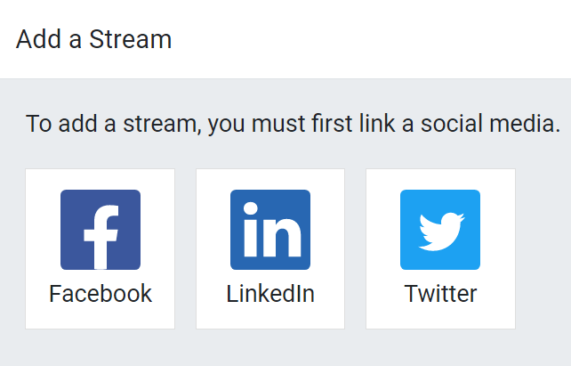
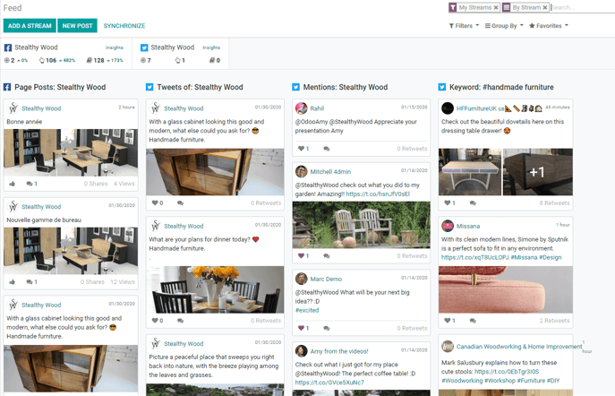
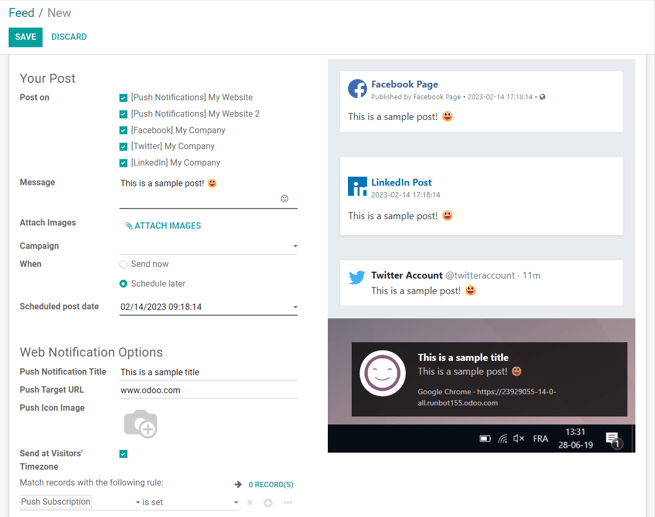
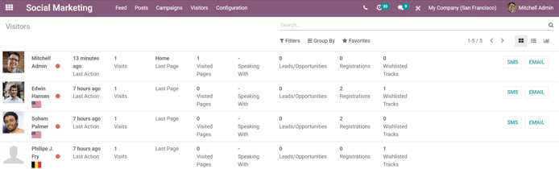
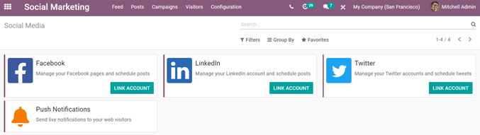
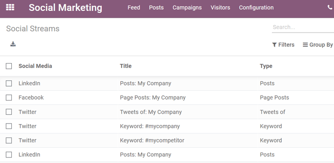

===========================
Social marketing essentials
===========================

Social media is one of the most effective ways for companies to boost brand awareness and reach
larger audiences in the marketplace. That's why it's vital for businesses to have reliable solutions
in place to aide in the maintaining and managing of various social media accounts.

Odoo *Social Marketing* is designed to create and schedule posts, manage various social media
accounts, analyze content effectiveness, and engage directly with social media followers in one,
centralized location.

Add social media accounts
=========================

In order to create posts, each social media account must be added as a stream in the Odoo *Social
Marketing* application.

Add a social media stream
-------------------------

Once the *Social Marketing* app is opened, Odoo displays the main dashboard, which consists of all
the social media accounts that have been added to the database.

To add a social media account as a stream in the Odoo *Social Marketing* app, start on the main
dashboard, and click :guilabel:`Add A Stream` located in the upper left corner.

When :guilabel:`Add A Stream` is clicked, the following pop-up appears, displaying the different
social media outlets to choose from.

.. note::
   More recent Odoo versions provide additional social media outlet options to choose from.

From this pop-up, select a social media option: :guilabel:`Facebook`, :guilabel:`LinkedIn`, or
:guilabel:`Twitter`.

Then, Odoo navigates directly to that specific social media outlet's authorization page, where
permission must be granted, in order for Odoo to add that particular social media account to the
*Social Marketing* application as a stream on the main dashboard of the app.

.. note::
   A Facebook page can be added as long as the Facebook account that grants permission is the
   Administrator for the page. Also, different pages can be added for different streams.

Once permission is granted, Odoo navigates back to the *Feed* on the main *Social Marketing*
dashboard, and a new column with that account's posts and/or publications are automatically added.

From here, new accounts and/or streams can be added and managed at any time.

.. note::
   Adding social media accounts to the feed also links that specific Social Media's KPIs (if the
   platform has them). To get redirected to the statistics and metrics related to any social
   account, click on :guilabel:`Insights`.

   .. image:: social_essentials/insights.png
      :align: center
      :alt: The insights link that can be accessed for each social media stream added in Odoo.

Create and publish social media posts in Odoo
=============================================

There are multiple ways to create content for social media accounts in the *Social Marketing*
application.

From the main :menuselection:`Social Marketing` dashboard, click :guilabel:`New Post`. Or, while in
the :menuselection:`Social Marketing` app, click :menuselection:`Posts --> Create`.

Either route reveals a blank post template page that can be customized and configured in a number
of different ways.

Post template
-------------

The post template page has many different options avaiable.

'Your Post' section
~~~~~~~~~~~~~~~~~~~

The first option is the *Post on* field. This is where it's determined on what social media
account(s), or on which website(s) via push notification, this post will be published.

.. important::
   In order for the *Push Notification* option to appear, make sure the *Enable Web Push
   Notifications* feature is enabled in the *Website* app. To do that, navigate to
   :menuselection:`Website --> Configuration --> Settings`, activate :guilabel:`Enable Web Push
   Notifications`, fill out the corresponding fields, and click :guilabel:`Save`.

Odoo automatically provides every available social media account that's been linked to the database
as an option in this section, as well.

.. note::
   If a social media account hasn't been added as a stream to the *Social Marketing* application, it
   will not appear as an option on the post template.

Next, there's the *Message* field. This is where the main content of the post is created.

Type the desired message for the post in this field. To the right, as the *Message* field is
populated, Odoo displays visual samples of how the post will look on all the previously selected
social media accounts from the *Post on* field above.

.. tip::
   Emojis can also be added directly to the text in the *Message* field. Just click the
   "smiley face" icon, located on the line of the *Message* field to the far right. Clicking that
   "smiley face" icon reveals a drop-down containing numerous emojis to choose from.

If images are to be used in the post, click the :guilabel:`ATTACH IMAGES` link beneath the
*Message* field, and Odoo reveals a pop-up window. In this pop-up, the desired image must be chosen,
and then uploaded.

A preview of the entire post, text and image (if applicable), is instantly displayed in the visual
preview of the post.

Next, there's the option to attach this post to a specific marketing campaign in the database in
the *Campaign* field. Click the blank line next to *Campaign* to reveal the previously configured
campaigns to choose from.

.. tip::
   A new campaign can be created on-the-fly, as well, by typing the name of the new campaign on the
   blank :guilabel:`Campaign` field, and selecting :guilabel:`Create` from the drop-down. Or, select
   :guilabel:`Create and edit` from the drop-down to further customize that newly-created campaign.

.. note::
   A social post does *not* need to be attached to a *Campaign*.

Then, in the :guilabel:`When` field, choose either :guilabel:`Send Now` to have Odoo publish the
post immediately, or :guilabel:`Schedule later` to have Odoo publish the post at a later date and
time.

If *Schedule later* is selected, Odoo reveals a new field beneath it (the *Scheduled post date*
field). Clicking that empty field reveals a pop-up calendar, in which a future date and time is
designated. At which time, Odoo will promptly publish the post on the pre-determined social media
accounts.

Click on the desired date to schedule the post for that day. Then, either select and customize
the default time in the :guilabel:`Scheduled post date` field manually. Or, adjust the desired post
time, by clicking the "clock" icon located on the calendar pop-up, and choose the desired time
for Odoo to publish this post on that future date.

If scheduling a post, remember to hit :guilabel:`Schedule` in the upper left of the post template.
Doing so, locks in that specific date/time for Odoo to send the post, and it changes the status of
the post to :guilabel:`Scheduled`, which will be discussed later on in this documentation, in the
:guilabel:`Social post status bar` section.

.. note::
   Also, when *Schedule* is clicked, a number of analytical smart buttons appear on the post page.
   Each one offers up a detailed anaylsis of the corresponding metric (e.g. *Leads*, *Revenues*,
   etc.). These same smart buttons appear when a post is officially published, as well.

'Web Notification Options' section
~~~~~~~~~~~~~~~~~~~~~~~~~~~~~~~~~~

If any *Push Notifications* are selected in the *Post on* field, Odoo provides another section of
settings/options at the bottom of the post template. It should be noted that *none* of these fields
are required.

The first field is for a *Push Notification Title*. This is text that is displayed as the title of
the push notification whenever it's sent. Odoo displays a visual preview of this title, if one is
created.

To designate a specific page on the website that should trigger this push notification, enter that
page's URL in the :guilabel:`Push Target URL` field. Then, once a visitor reaches that specific
page, Odoo will display the push notification.

Below that field is the option to add a custom *Push Icon Image*. This is a icon that appears beside
the push notification. By default, Odoo uses a "smiley face" as the icon.

To upload a new image, click the :guilabel:`Edit` icon, displayed as a "pencil" when the
:guilabel:`Push Icon Image` field is hovered over with the cursor. Then, proceed to locate and
upload the desired image, and Odoo automatically displays a preview of how the icon will appear on
the push notification.

Next, there is the option to :guilabel:`Send at Visitors' Timezone`. If enabaled, Odoo will send it
at the appropriate, pre-determined time, taking the visitor's location into consideration.

Save, post, and test notification options
-----------------------------------------

When all the modifications have been made, and the post is completed, either click :guilabel:`Save`
to save the post as a *Draft*. Or, if the post is ready to be published immediately, click
:guilabel:`Post`, and Odoo automatically publishes the post on the pre-determined social media
accounts.

There is also the option to :guilabel:`Test Notification`, if a *Push Notification* was selected in
the *Post on* field. Clicking that, provides a quick example of how the notification will appear for
visitors.

Social post status bar
----------------------

In the top-right of the post template page is the status bar. This displays the current status of
the post.

When *Save* is clicked, the post is in the *Draft* status.

If the post is scheduled to be sent at a future date/time, and the *Schedule* button has been
clicked, the status of the post is *Scheduled*.

If the post is in the process of currently being published or sent, the status of the post is
*Posting*. And, lastly, if the post has already been published or sent, the status is *Posted*.

'Posts' page
============

To see a complete overview of posts, go to :menuselection:`Odoo Social Marketing`, and click
:menuselection:`Posts` in the header menu. Here, every post that has been created and posted with
Odoo is available.

There are four different view options for *Posts* page data: *kanban*, *calendar*, *list*, and
*pivot*. The view options are located in the upper right corner of the *Posts* page, beneath the
*Search* bar.

.. tabs::

   .. tab:: Kanban view

      By default, Odoo displays the posts in a *kanban* view. The information on this page can sorted
      even further, via the *Filters* and *Group by* drop-down menu.

      .. image:: social_essentials/posts-page.png
         :align: center
         :alt: Kanban view of the posts page in the Odoo Social Marketing application.

   .. tab:: Calendar view

      The *calendar* view option displays a visual representation in a calendar format of when posts
      were published, or are scheduled to be published. This option provides a clear overview of any
      planned day, week, or month, and Odoo displays all drafted, scheduled, and published posts.

      .. image:: social_essentials/calendar-view.png
         :align: center
         :alt: Example of the calendar view in Odoo Social Marketing.

   .. tab:: List view

      The *list* view option is similar to the *kanban* option, but instead of individual blocks,
      all the post information is displayed in a clear, list layout. Each line of the list displays
      the *Social Accounts*, *Message*, and *Status* of every post.

      .. image:: social_essentials/list-view.png
         :align: center
         :alt: View of the list option on the posts page in Odoo Social Marketing.

   .. tab:: Pivot view

      The *pivot* view option provides a fully customizable grid table, where different measures of
      data can be added and analyzed.

      .. image:: social_essentials/pivot-view.png
         :align: center
         :alt: View of the pivot option on the posts page in Odoo Social Marketing.

      The pivot view option provides numerous analytical options, allowing for in-depth, detailed
      analysis of various posts.

      Click on any :guilabel:`+` (plus sign) next to a line in the pivot table to reveal more metric
      options to add to the grid.

      While in the pivot view, the option to *Insert in Spreadsheet* is available, located to the
      right of the *Measures* drop-down.

      When clicked, a pop-up appears, where the option to add this information to a current
      spreadsheet is available. The option to create a new spreadsheet for this information
      on-the-fly is also available in this pop-up, as well.

      Next to the *Insert in Spreadsheet* are three view options, specific to the pivot view.

      From left to right, the options are:

      - *Flip Axis*, which switches the 'X' and 'Y' axis in the grid table.
      - *Expand All*, which expands each line in the grid, revealing more detailed information
        related to it.
      - *Download*, which, when clicked, instantly downloads the pivot table as a spreadsheet.

Visitors
========

To see a complete overview of all the people who have visited the website(s) connected to the
database, click :menuselection:`Visitors` in the header menu of the *Social Marketing* app.

Here, Odoo provides a detailed layout of all the visitors' pertinent information in a default
kanban view. This same information can be sorted via the *Filters* and *Group By* options.

The visitor data can also be viewed as a list or a graph. Those view options are located in the
upper-right corner of the *Visitors* page beneath the *Search* bar.

Social media page
=================

Go to :menuselection:`Configuration --> Social Media` to see a collection of all social media
options: :guilabel:`Facebook`, :guilabel:`LinkedIn`, :guilabel:`Twitter`, and :guilabel:`Push
Notifications`.

If no account has been linked to any particular social media, click :guilabel:`Link Account` to
proceed through the linking process.

Social accounts page
====================

To see a list of all social accounts linked to the database, go to :menuselection:`Configuration -->
Social Accounts`. This page will display the *Medium Name* and the *Social Media* platform it is
associated with.

.. image:: social_essentials/social-accounts-page.png
   :align: center
   :alt: View of the social accounts page in the Odoo Social Marketing application.

To edit/modify any social accounts, simply select the desired account from the list on this page,
and proceed to make any adjustments necessary. Don't forget to hit :guilabel:`Save` to secure any
changes.

Social streams page
===================

Navigate to :menuselection:`Configuration --> Social Streams` reveals a separate page containing all
the social media streams that have been added to the main dashboard of the *Social Marketing* app,
accessible via the *Feed* option in the header menu.

Here, the social stream information is organized in a list with the *Social Media*, the *Title* of
the stream, and the *Type* of the stream (e.g. *Posts*, *Keyword*, etc.).

To modify any stream's information, simply click the desired stream from the list, and proceed to
make any necessary adjustments. Don't forget to hit :guilabel:`Save` to secure any changes.

.. seealso::
   :doc:`/applications/marketing/social_marketing/essentials/social_campaigns`
